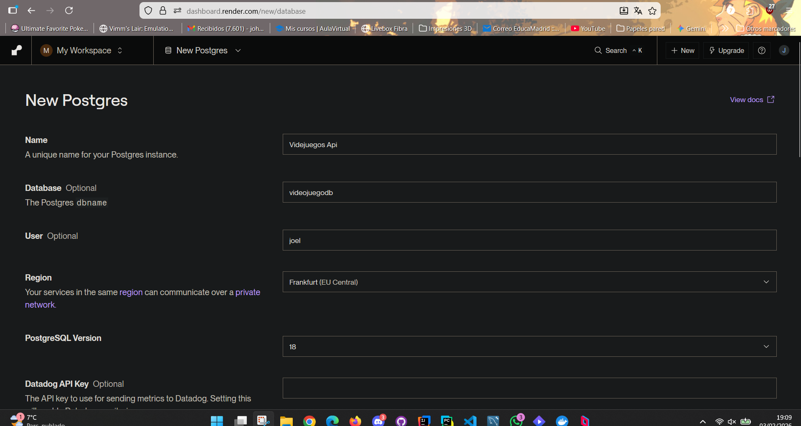
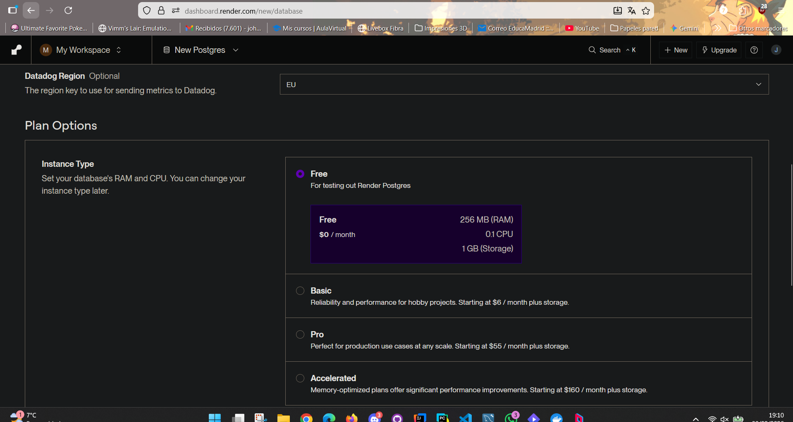
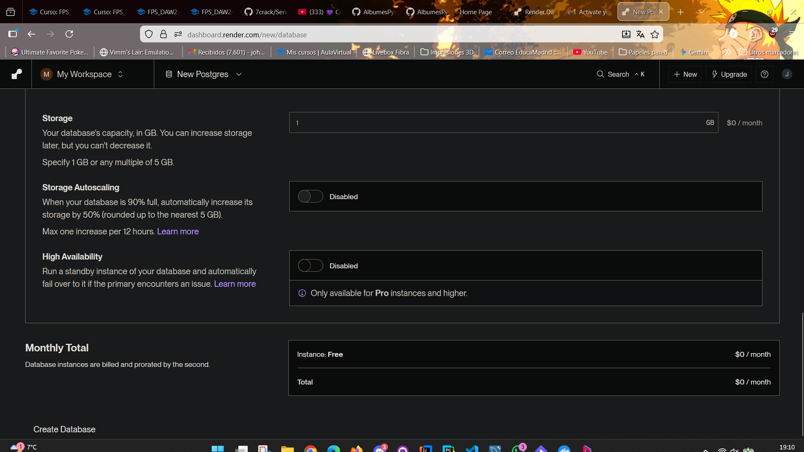
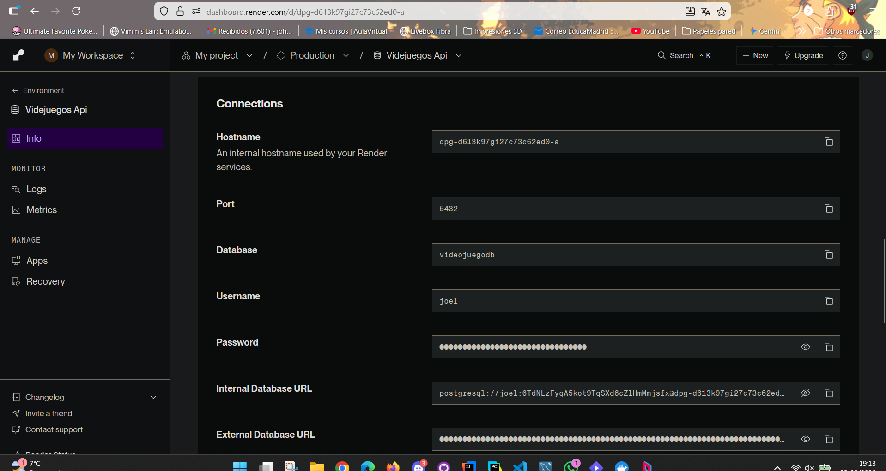
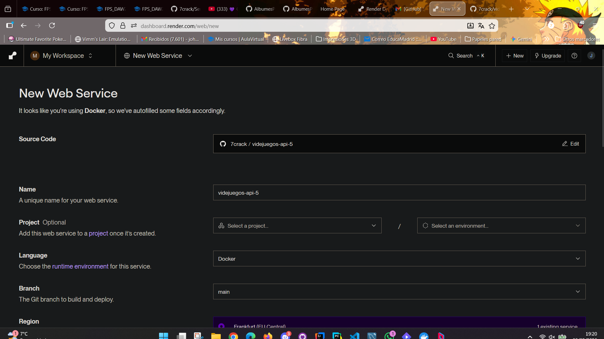
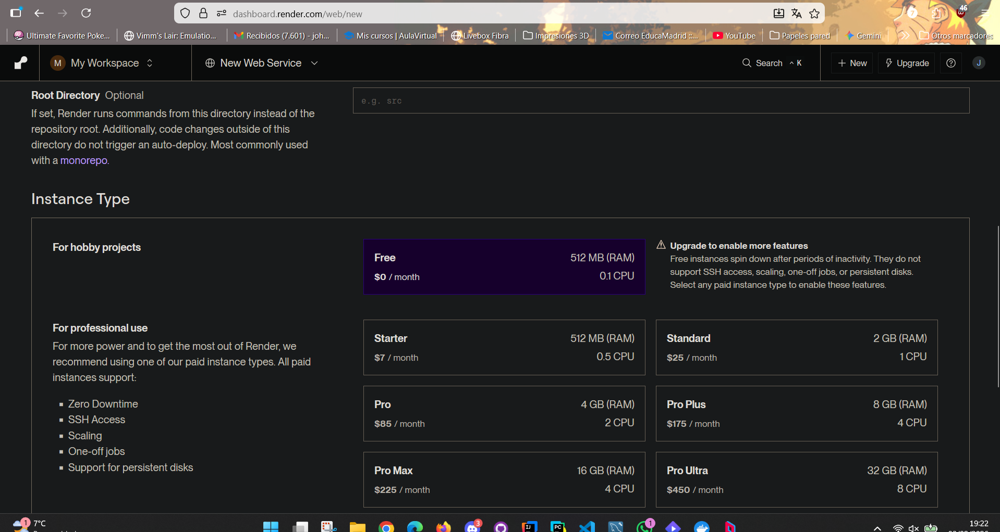
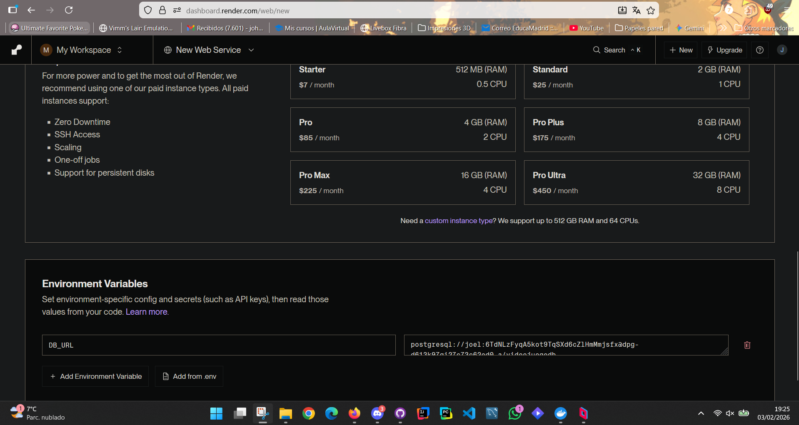
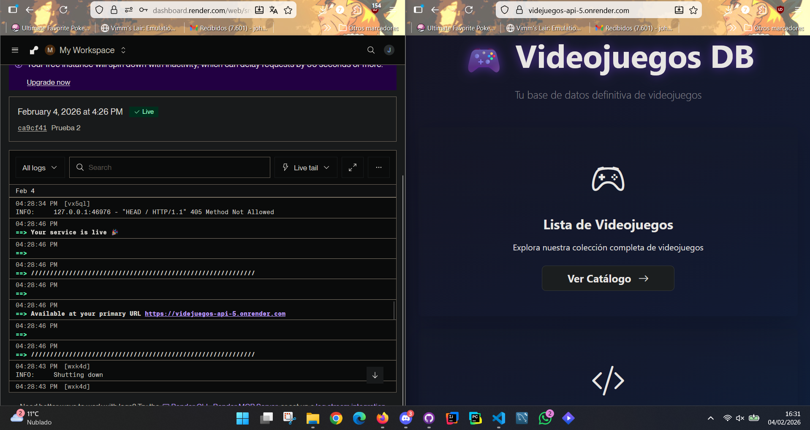

# Documentación Técnica - Proyecto Videojuegos API

## 5. Despliegue en Render

El proyecto se despliega en Render utilizando dos servicios independientes: un Web Service para la aplicación FastAPI y una base de datos PostgreSQL gestionada.

**Arquitectura en Render:**
- **Web Service**: Contenedor Docker con FastAPI (puerto 8000)
- **PostgreSQL Database**: Base de datos gestionada por Render
- **Comunicación**: Internal Database URL proporcionada por Render

**Configuración de la base de datos:**
- Servicio PostgreSQL independiente creado en Render
- Conexión mediante Internal Database URL
- Variable de entorno `DATABASE_URL` configurada en el Web Service
- PostgreSQL 16 con almacenamiento persistente gestionado por Render

**Pasos para desplegar:**
1. **Crear PostgreSQL Database en Render:**
   - Dashboard → New → Postgre
   - Configurar nombre, región y plan (Free disponible)
   - Copiar la Internal Database URL generada
   
   
   
   
   
2. **Configurar Web Service:**
   - Crear nuevo Web Service desde repositorio Git
   - Configurar variable de entorno: `DATABASE_URL=<internal-database-url>`
   - Render detecta automáticamente el Dockerfile y despliega
   
   
   

**Verificación:**
Aquí tienes un link que te lleva a la página web y al Github:
## [Videojuegos Api](https://videjuegos-api-5.onrender.com/) | [GitHub](https://github.com/7crack/videjuegos-api-5)
